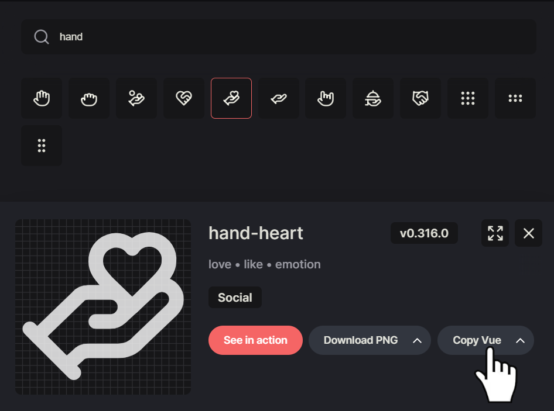

# lucide-nuxt

[![npm version][npm-version-src]][npm-version-href]
[![npm downloads][npm-downloads-src]][npm-downloads-href]
[![License][license-src]][license-href]
[![Nuxt][nuxt-src]][nuxt-href]

lucide-vue-next auto-imports for Nuxt 3 for the best DX with Lucide Icons.

<!-- - [✨ &nbsp;Release Notes](/CHANGELOG.md) -->
  <!-- - [🏀 Online playground](https://stackblitz.com/github/your-org/lucide-nuxt?file=playground%2Fapp.vue) -->
  <!-- - [📖 &nbsp;Documentation](https://example.com) -->

## Features

- 📝&nbsp;Copy and paste from the [lucide website](https://lucide.dev/icons) without worrying about the
  import.
- 💌&nbsp;Easy to setup, just one command!

## Quick Setup

Install the module to your Nuxt application with one command:

```bash
npx nuxi module add lucide-nuxt
```

That's it! You can now use lucide-nuxt in your Nuxt app ✨

## Usage

Search for an icon on [https://lucide.dev/icons](https://lucide.dev/icons) and
click on copy Vue.



Paste into your template.

```vue
<template>
  <HandHeart />
</template>
```

## Configuration

You can change the prefix via the following code. In the example
y use _Lucide_ as the custom prefix.

```ts
export default defineNuxtConfig({
  modules: ["lucide-nuxt"],
  lucide: {
    prefix: "Lucide",
  },
});
```

```vue
<template>
  <LucideCamera />
</template>
```

## Contribution

<details>
  <summary>Local development</summary>
  
  ```bash
  # Install dependencies
  npm install
  
  # Generate type stubs
  npm run dev:prepare
  
  # Develop with the playground
  npm run dev
  
  # Build the playground
  npm run dev:build
  
  # Run ESLint
  npm run lint
  
  # Run Vitest
  npm run test
  npm run test:watch
  
  # Release new version
  npm run release
  ```

</details>

<!-- Badges -->

[npm-version-src]: https://img.shields.io/npm/v/lucide-nuxt/latest.svg?style=flat&colorA=020420&colorB=00DC82
[npm-version-href]: https://npmjs.com/package/lucide-nuxt
[npm-downloads-src]: https://img.shields.io/npm/dm/lucide-nuxt.svg?style=flat&colorA=020420&colorB=00DC82
[npm-downloads-href]: https://npmjs.com/package/lucide-nuxt
[license-src]: https://img.shields.io/npm/l/lucide-nuxt.svg?style=flat&colorA=020420&colorB=00DC82
[license-href]: https://npmjs.com/package/lucide-nuxt
[nuxt-src]: https://img.shields.io/badge/Nuxt-020420?logo=nuxt.js
[nuxt-href]: https://nuxt.com
